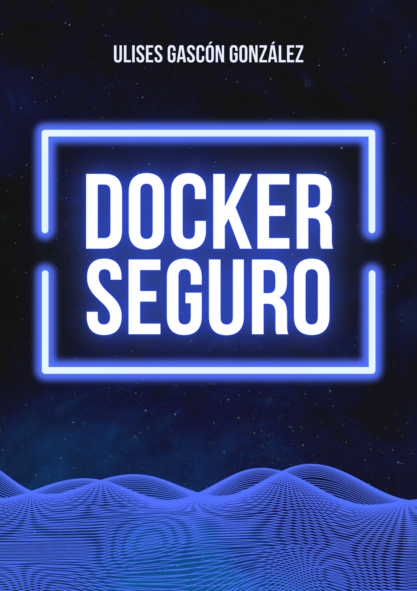

# [Docker Seguro](https://leanpub.com/docker-seguro) por [Ulises Gascón](https://ulisesgascon.com)

***Un libro que explica en detalle cómo afrontar los retos de Docker en entornos productivos.***

> “Most good programmers do programming not because they expect to get paid or get adulation by the public, but because it is fun to program.”
> – *Linus Torvalds*

### Acerca de este libro

#### Un libro que explica en detalle cómo afrontar los retos de Docker en entornos productivos.

Empezamos este viaje juntos, desde el estado actual del arte en Docker y su arquitectura, para pasar rápidamente al despliegue de contenedores de forma segura. A continuación, analizaremos los retos que nos plantea la creación y distribución de imágenes. Terminaremos hablando de herramientas que pueden ayudarnos a gestionar Docker de una forma mucho más eficiente.

#### ¿Qué necesito saber antes de empezar?

Es necesario tener un conocimiento medio/avanzado de Docker, entre otras cuestiones:
- Creación de imágenes
- Despliegue de contenedores
- Manejo en el uso de `volumes`, `network`, etc..
- Experiencia básica con la gestión de múltiples contenedores en un entorno con algún orquestador como Docker compose, Portainer, Kubernetes...

Si esto no te suena ajeno, no tendrás problema para seguir el libro.

#### ¿Qué aprenderemos?

- El contexto de los contenedores en la infraestructura moderna
- Arquitectura de Docker
- Modelo de amenazas y OWASP TOP 10 específicos de Docker
- Desplegar contenedores de forma segura (Host, Redes, volúmenes, límites, permisos...)
- Publicar mejores imágenes (Inmutabilidad, firmas, dependencias, Buildkit, tags, firmado...)
- Colección de herramientas para mejorar tu experiencia de desarrollo con Docker

## Importante

- **Humor:** Si no te ríes en algún momento mientras lees este libro.... claramente no es para ti y no he cumplido el reto de intentar enseñarte cosas alucinantes con un poco de humor 😆
- **Adaptable:** En principio este libro está disponible en tres formatos básicos *pdf*, *markdown*, *web* y su código fuente está en [repositorio en GitHub](https://github.com/UlisesGascon/docker-seguro)
- **Este libro está vivo:** Con el tiempo irá creciendo y mejorando. Mantente al día desde su *[página oficial](https://dockerseguro.ulisesgascon.com)*
- **Un mar de recursos:** La mayoría de los links del libro, os dirigen a blogs técnicos y a la documentación oficial de *[Docker](https://www.docker.com/)*. Si un concepto resulta difícil de entender o deseas profundizar más... Estos links pueden ser un buen punto de partida.
- **Facilidades:** La mayor parte del código está creado con la nomenclatura en español, para facilitar la comprensión y lectura. No obstante, recuerda que esto no está considerado una buena práctica en entornos profesionales.
- **¡A tu ritmo!:** A lo largo del libro observarás que no encontrarás ejercicios, para así hacer más ágil su lectura.

### Comparte este libro

- [Twitter](https://twitter.com/intent/tweet?text=Acabo%20de%20conseguir%20el%20%23ebook%20%23Dockerseguro%20de%20@kom_256%20en%20https://dockerseguro.ulisesgascon.com)
- [Facebook](https://www.facebook.com/sharer/sharer.php?u=https://dockerseguro.ulisesgascon.com)

### Cero coste, 0$

Este libro es completamente gratuito, con un doble objetivo, que nadie se quede sin aprender por no tener recursos y además para contribuir de este modo a la comunidad del software libre.

Aunque el libro es gratuito, [Leanpub](https://leanpub.com/causes) permite comprar este libro al precio que tu consideres. Todos los beneficios generados serán donados íntegramente a [Electronic Frontier Foundation (EFF)](https://leanpub.com/causes/eff) desde la propia plataforma de [Leanpub](https://leanpub.com/causes). El autor no percibirá nada de esas donaciones

### Leer el libro

Existen tres formas de consumir el libro:
- La más recomendada: como [web](https://dockerseguro.ulisesgascon.com/)
- [Markdown](manuscript/sumario.md)
- [PDF](docker_seguro_por_ulises_gascon.pdf)

### Feedback

Puedes compartirme tu opinión de diversas formas:

- [Mensaje directo (email)](https://leanpub.com/docker-seguro/email_author/new)
- [Dejando tu testimonio en este issue](https://github.com/UlisesGascon/docker-seguro/issues/1)

### Contribuir

Todo el código fuente está en [este repositorio](https://github.com/UlisesGascon/docker-seguro) de GitHub. Este libro es algo vivo y por ello estará evolucionando constantemente.

Recuerda que tu puedes formar parte de todo esto, colaborando.

Existen muchas formas de colaborar:

- Avisando de los errores y de las posibles erratas que pudieses encontrar en el código
- Mejorando los ejemplos
- Traduciendo este libro a otros idiomas para que llegue a más lectores
- Compartiendo tus sensaciones en twitter con el hashtag [#dockerseguro](https://twitter.com/search?f=tweets&q=%23dockerseguro)

Encontrarás más información en el archivo [CONTRIBUTING.md](CONTRIBUTING.md).

### Licencia

**ISBN:** _978-84-09-44492-2_

Este libro esta licenciado como [Creative Commons Attribution-NonCommercial-ShareAlike 4.0 International License](https://creativecommons.org/licenses/by-nc-sa/4.0/deed.es_ES) aunque no necesariamente las imágenes de su interior.
