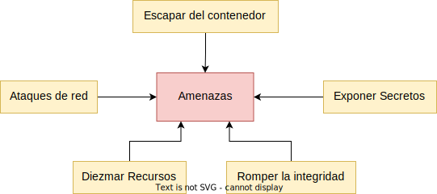

# Capítulo 1: El reto de los contenedores

En este capítulo centraremos los esfuerzos en entender los retos y posibilidades que nos ofrece Docker.

Repasamos el ciclo de vida de los contenedores y los pilares sobre los que se asienta Docker. Finalmente veremos en profundidad todas las amenazas y vectores que tenemos cuando usamos y creamos contenedores con Docker, para poco a poco ir centrándonos en las mitigaciones disponibles en los siguiente capítulos.

### 1.1 Estado del Arte

Si vemos [cualquier informe sobre el uso de Docker](https://www.datadoghq.com/docker-adoption/) nos sorprenderá la gran aceptación que ha tenido. Este cambio de paradigma en el mundo del software ha facilitado mucho las cosas a base de añadir una abstracción sobre el despliegue de nuestras aplicaciones.

Entiendo que es responsabilidad de todos entender y manejar estas abstracciones lo suficiente, como para poder hacer despliegues de forma segura.

Cuando vemos informes como "[The state of Open Source Security Report 2022](https://snyk.io/reports/open-source-security/)" de Snyk, podemos ver claramente la tendencia actual de tener cada vez más dependencia de otras librerías y observamos que no estamos todavía entendiendo el problema que ello supone, sino tenemos unas políticas claras en nuestra relación con el open source y en cómo vamos a mantener esas dependencias actualizadas ([capítulo 2.2.1](c02.md#221-imágenes-base)).

Con Docker, también introducimos más dependencias ya que consumiremos imágenes creadas por terceros ([capítulo 3.1.1](c03.md#311-elegir-la-imagen-base)).

Si revisamos [el historial de vulnerabilidades reportadas](https://docs.docker.com/engine/security/non-events/) y parcheadas de Docker, nos damos cuenta que esta tecnología es bastante compleja, y si no estamos familiarizados con su arquitectura o su ciclo de vida difícilmente podremos entender cuando esas vulnerabilidades reportadas son un riesgo real para nuestros proyectos o nuestra organización.

Existe una idea creciente de que los contenedores son tan aislados, robustos, inmutables y seguros como los contenedores marítimos. La realidad es un poco distinta a esa imagen idealizada que tenemos. Se puede llegar a tener contenedores robustos y seguros, pero no es tan sencillo como mover contenedores marítimos con nuestra grúa imaginaria.

_Fotografía de [Bernd Dittrich](https://unsplash.com/es/fotos/Z-HBjM62f6M)_

Como veremos a lo largo del libro, [Docker se apoya en muchas tecnologías existentes](https://docs.docker.com/engine/security/) para lograr ese concepto idealista de contenedor marítimo, entre otras en Kernel namespaces y Control Groups ([capítulo 2.3](c02.md#23-conceptos-avanzados)).

A finales de 2020 corrió como la pólvora [el anuncio](https://github.com/kubernetes/kubernetes/blob/master/CHANGELOG/CHANGELOG-1.20.md#deprecation) de que Kubernetes en su versión 1.20.0 "retiraba el soporte a Docker" y el pánico se hizo presa de la comunidad. En realidad lo que hizo Kubernetes fue retirar el soporte a `dockershim`.

Kubernetes llegó incluso a publicar [una entrada en su blog](https://kubernetes.io/blog/2022/01/07/kubernetes-is-moving-on-from-dockershim/) explicando en detalle porque esto no sería un drama para nadie en realidad (salvo que [usarás comandos de Docker directamente](https://kubernetes.io/docs/tasks/administer-cluster/migrating-from-dockershim/check-if-dockershim-removal-affects-you/)) y terminó añadiendo también un [FAQ](https://kubernetes.io/blog/2020/12/02/dockershim-faq/) específico sobre este tema.

Personalmente, no me sorprende que se creara un gran alarmismo, ya que a día de hoy muchas personas siguen pensando que Docker es contenedores y que no existe nada más allá. 

El concepto de los contenedores [ya existía antes de Docker](https://blog.aquasec.com/a-brief-history-of-containers-from-1970s-chroot-to-docker-2016) y aunque mucho de la adopción de este patrón se lo debemos a [Docker Inc](https://www.docker.com/company/), lo cierto es que existe un mundo gigante donde ya tenemos la [Cloud Native Computing Foundation](https://www.cncf.io/) y se han creado varios estándares e iniciativas para normalizar esta tecnología de una forma sólida y homogénea.

### 1.2 Los pilares de Docker

Aunque los contenedores han sido un gran avance en la adopción de la nube y las prácticas DevOps, no nos exime de conocer, prevenir y mitigar los posibles ataques que suframos. Este puede parecer una tarea abrumadora en un principio, sin embargo a lo largo del libro encontrarás estrategias y recursos que te ayudarán a superarlo.

El vector de ataque principal en el caso de los contenedores, se basa en la relación que existe entre el host y el propio contenedor. De esta forma, a medida que entendamos qué compartimos entre el host y el contenedor a nivel del sistema operativo y qué recursos podemos compartir o no con el contenedor, podremos prevenir o mitigar la mayoría de los vectores de ataques conocidos a día de hoy con Docker.

#### Arquitectura

Uno de los puntos más complicados de entender cuando trabajamos con Docker, es comprender que el Kernel es compartido entre el host ([capítulo 2.1.3](c02.md#213-el-poder-de-root)) y los contenedores, no como sucede con las máquinas virtuales que utilizan una solución [Hypervisor](https://es.wikipedia.org/wiki/Hipervisor)

_Imagen derivada de [Geek Flare](https://geekflare.com/es/docker-vs-virtual-machine/) para adaptar el formato_

Como resultado de compartir el Kernel podemos sufrir una serie de ataques:
- Cuando escapamos del contenedor y tenemos acceso a otros contenedores o al propio host. [Ejemplo del uso de Dirty Cow (CVE-2016-5195)](https://blog.paranoidsoftware.com/dirty-cow-cve-2016-5195-docker-container-escape/) para salir del contenedor ([capítulo 2.2.4](c02.md#224-redes)).  
- Cuando no gestionamos correctamente el [uso de namespaces](https://en.wikipedia.org/wiki/Linux_namespaces) y permitimos que un contenedor pueda tener acceso root a la máquina host o muchos de los recursos y dispositivos presentes ([capítulo 2.2.2](c02.md#222-archivos-y-carpetas)).
- Al no imponer límites a los contenedores, podemos sufrir denegaciones de servicio dentro de la máquina host, impidiendo que recursos legítimos accedan a módulos y recursos del sistema host por falta de recursos ([capítulo 2.2.5](c02.md#225-limitación-de-recursos)).

#### Ciclo de vida

Cada parte del ciclo de vida tiene sus propios retos, pero teniendo unas estrategias claras podremos hacer frente sin problemas.

##### Dockerfile 
En muchas ocasiones usaremos imágenes de terceros directa o indirectamente como base para las que nosotros creemos (añadiendo nuestras propias capas). 

Podemos hacer mucho a la hora de crear nuestras propias imágenes para mejorar la seguridad, como utilizar imágenes firmadas y para minimizar los riesgos por ejemplo tener una política bien definida sobre qué ficheros y carpetas formarán parte de la imagen ([capítulo 3](c03.md)).

##### Imagen

Las imágenes deben poder subirse y descargarse de una forma segura de los registros públicos o privados que usemos ([capítulo 3](c03.md)).

##### Contenedor

Crear imágenes es una cosa, pero mantener nuestros contenedores corriendo en entornos productivos tiene muchos retos de seguridad que tienen que ver con cómo establecemos esa relación con la máquina host (redes, ficheros, dispositivos...) y cómo hacemos políticas efectivas (Seecomp, AppArmor, permisos, capacidades), sin olvidarnos de la configuración del propio demonio de Docker y las actualizaciones regulares de los contenedores y del propio host ([capítulo 2](c02.md))

#### Dependencias

Otro punto importante, es entender que Docker parte de la base de que el código que estamos ejecutando en esos contenedores es fiable y que nosotros como usuarios hemos validado previamente que esa imagen se corresponda con lo que nosotros esperamos. Si nosotros decidimos ejecutar imágenes de Docker que no cuentan con garantías de seguridad  (potencialmente maliciosas) o que entrañan algún riesgo, podríamos poner en peligro nuestra máquina host o nuestra propia infraestructura, por ejemplo compartiendo variables de entorno u otros datos sensibles con contenedores malintencionados ([capítulo 2.2.3](c02.md#223-gestión-de-secretos)). 

En ocasiones usamos imágenes que son confiables pero sus dependencias no son inmutables pudiendo generar vulnerabilidades a través de ellas, lo que se conoce como [Supply Chain attacks](https://www.docker.com/blog/the-impacts-of-an-insecure-software-supply-chain/)

Muchas de las dependencias de nuestros proyectos dependen directa o indirectamente del Software Libre. Esto lleva años generando presión sobre una comunidad de maintainers que está [muy lejos de ser sostenible con garantías](https://thenewstack.io/sos-sustainable-open-source/). 

Desde hace algún tiempo se enmascara este problema estableciendo una metáfora con el concepto de "Supply Chain". 

> When you take on an additional dependency in a software project, often money does not change hands. npm install and cargo add do not bill your credit card. There is no formal agreement between a maintainer and its downstream users.
> [Iliana Etaoin](https://iliana.fyi/blog/software-supply-chain/)

### 1.3  Threat Modeling

La fundación (OWASP) incluye [un modelo de amenazas específico para Docker](https://github.com/OWASP/Docker-Security/blob/main/001%20-%20Threats.md) que nos ayuda a visualizar en una sola imagen todo lo que tenemos que tener en cuenta

_Imagen derivada de [OWASP](https://github.com/OWASP/Docker-Security/blob/main/001%20-%20Threats.md) para adaptar el formato_

Para hacerlo más sencillo y didáctico he decido hacer una clasificación alternativa al modelo de amenazas que [plantea la fundación OWASP](https://github.com/OWASP/Docker-Security/blob/main/001%20-%20Threats.md), tomándome la licencia de agrupar y reducir algunas casuísticas para facilitar la comprensión. 

#### Escapar del contenedor

En un ataque contra contenedores, el primer paso es intentar hacerse con el control del contenedor y el siguiente paso será escalar permisos e intentar hacerse con el control de la máquina host.

Si realizamos una mala configuración del contenedor y permitimos el acceso `root` o permitimos la ejecución del contenedor con muchas capacidades/permisos podemos acabar [comprometiendo la máquina host](https://greencashew.dev/posts/how-to-add-reverseshell-to-host-from-the-privileged-container/) ([capítulo 2.1.3](c02.md#213-el-poder-de-root))

#### Ataques de red

Los contenedores muy frecuentemente están abiertos al tráfico a través de uno o múltiples puertos. La configuración de redes es un tema complejo que requiere su tiempo ([capítulo 2.2.4](c02.md#224-redes)).

Si hacemos una configuración incorrecta de red podemos acabar en escenarios de todo tipo cuando ese contenedor se ve comprometido con acceso a la red:
- Contenedor que comparte red con el Host. Esto permite hacer ataques a la interfaces vía red de los orquestadores presentes en el host, así como otras aplicaciones que tengan puertos abiertos, etc... En casos muy extremos podríamos incluso sufrir una expansión del ataque a la red donde la propia máquina host está conectada.
- Contenedor que comparte red con otros contenedores (sin necesidad de ello). Esto brinda la posibilidad de expandir el ataque a otros contenedores vía red.

#### Diezmar recursos

Ya sea porque estemos sufriendo un ataque intencionado o porque nuestro contenedor tenga un error de diseño como un [memory leak](https://es.wikipedia.org/wiki/Fuga_de_memoria) , podemos fácilmente drenar los recursos de la máquina host si no establecemos unos límites a nuestros contenedores ([capítulo 2.2.5](c02.md#225-limitación-de-recursos)).

Hacer que la máquina host se vuelva inestable por falta de recursos es otra forma de sabotear una infraestructura. Si además esa máquina host se encarga de orquestar otros servicios, podemos en ocasiones generar verdaderos problemas con nuestros clientes.

Este tipo de problemas de recursos pueden tornarse rápidamente muy costosos en términos económicos si estamos usando infraestructuras escalables en la nube y no hacemos una configuración correcta de las mismas.

#### Romper la integridad

Hablaremos de _poisoned images_ (imágenes envenenadas) cuando estas estén desactualizadas y existan vulnerabilidades conocidas que puedan ser comprometidas, así como a su contenido. También incluye el caso de dockerizar un proyecto y que este incluya vulnerabilidades en sus propias dependencias o las imágenes que nos descarguemos no sean las que esperamos, sufriendo así un ataque _man in the middle_ ([capítulo 2.3.3](c02.md#233-verificar-las-imágenes)).

Un ejemplo sencillo: Creamos una imagen de Docker que por un error de diseño en nuestro propio código permite inyecciones SQL y que [se exploten para la ejecución de comandos a través de una reverse shell](https://null-byte.wonderhowto.com/how-to/use-sql-injection-run-os-commands-get-shell-0191405/). 

#### Exposición de secretos

Este riesgo está siempre presente, podemos accidentalmente exponer información sensible por un error en nuestra lógica de negocio en la aplicación o por contar con alguna vulnerabilidad conocida, como un servidor web que permita un ataque tipo [path traversial](https://owasp.org/www-community/attacks/Path_Traversal) 
y acabe exponiendo nuestro fichero `.env`  o similares ([capítulo 2.2.3](c02.md#223-gestión-de-secretos)).

Pero también existen escenarios donde excedemos el nivel de información a la que accede un contenedor, por ejemplo dando acceso completo a un volumen del host cuando solo necesitaria una carpeta específica o garantizando acceso `root` al contendor con privilegios suficientes como para poder montar los volúmenes de la máquina anfitriona en el contenedor  ([capítulo 2.2.2](c02.md#222-archivos-y-carpetas)).

### 1.4 OWASP Docker Top 10

La fundación OWASP ofrece desde hace años el [OWASP TOP 10](https://owasp.org/www-project-top-ten/) y nos orienta sobre los 10 aspectos más críticos a tener en cuenta para securizar nuestras aplicaciones web según las tendencias que se han detectado en años anteriores.

Para docker existe un proyecto similar conocido como [OWASP Docker Top 10](https://github.com/OWASP/Docker-Security/blob/main/D00%20-%20Overview.md). En este libro, expondremos de forma específica, como mitigar los retos que nos presenta la lista.

Haremos de esta sección, un índice rápido y alternativo para este libro que está muy relacionado con el modelo de amenazas ([sección 1.2](c01.md#12-los-pilares-de-docker)).

#### D01 - Secure User Mapping

Los privilegios en Docker pueden ser muy contraproducentes para nuestro host, para evitarlo debemos tener claro cómo manejar `root` ([capítulo 2.1.3](c02.md#213-el-poder-de-root)).
 
#### D02 - Patch Management Strategy

A lo largo del tiempo se van descubriendo vulnerabilidades en los sistemas que utilizamos y que los fabricantes o maintainers van parcheando. Es importante tener una política clara sobre cómo llevar a cabo el parcheado de nuestro sistema Host, así como de los contenedores asociados. Puedes encontrar toda la información en los capítulos [2.2.5](c02.md#225-limitación-de-recursos) y [2.2.1](c02.md#221-imágenes-base).

Recordemos que a su vez este punto está conectado con el [OWASP top 10](https://owasp.org/Top10/) general. En esta edición se conoce como [A06:2021 – Vulnerable and Outdated Components](https://owasp.org/Top10/A06_2021-Vulnerable_and_Outdated_Components/), ya que es común que no actualicemos, incluso cuando existen vulnerabilidades conocidas que están siendo explotadas de forma activa.

#### D03 - Network Segmentation and Firewalling

El diseño y la evolución de las redes que organices en tu sistema condiciona bastante los posibles vectores de ataque entre contenedores y sobre todo entre el host y los contenedores.

A lo largo de los últimos años se han realizado diversos cambios en el demonio de Docker, _depreciando_ ciertos comandos que se han usado de forma asidua. Puedes encontrar todas las referencias en el [capítulo 2.2.4](c02.md#224-redes)

#### D04 - Secure Defaults and Hardening

Independientemente de cómo controlemos el ciclo de vida de nuestros contenedores, necesitaremos tener claro que tanto los contenedores, como el host y el orquestador si lo hubiera, deben ser revisados y bastionados desde un principio, independientemente de que el entorno en el que nos encontremos sea local o productivo. Para ello dedicamos el [capítulo 2](c02.md)  y especialmente la [sección 2.2.1](c02.md#221-imágenes-base) a ello

#### D05 - Maintain Security Contexts

Independientemente del sistema de orquestación que utilices, es importante evitar que los contenedores se mezclen o compartan recursos entre sí, cuando no sea necesario o por errores de diseño.

Por esta razón es importante introducir políticas de límites y artefactos que permitan mantener los contextos aislados, de lo que hablamos en el [capítulo 2.3](c02.md#23-conceptos-avanzados)

#### D06 - Protect Secrets

La gestión de secretos siempre es un reto, porque podemos acabar filtrando de forma accidental en los logs, o quedar expuestos a actores maliciosos. A esto dedicamos el [capítulo 2.3.3](c02.md#233-verificar-las-imágenes).

#### D07 - Resource Protection

La limitación de recursos es necesaria cuando usamos contenedores para evitar escenarios de tipo Denegación de Servicios (DoS) en el host por falta de recursos. Ver [capítulo 2.2.5](c02.md#225-limitación-de-recursos)

#### D08 - Container Image Integrity and Origin

Docker parte de la premisa como vimos en la sección anterior ([capítulo 1.3](c01.md#13--threat-modeling)), que los contenedores que usamos en nuestro sistema consumen imágenes seguras y verificadas por nosotros.

Esto en ocasiones supone un reto porque debemos de elegir entre las muchas imágenes potenciales desarrolladas por la comunidad. Para ello hemos dedicado las secciones [2.2.1](c02.md#221-imágenes-base) y [3.1.1](c03.md#311-elegir-la-imagen-base). También podemos hacer uso de mecanismos avanzados como la validación de la firma de imágenes ([sección 2.3.3](c02.md#233-verificar-las-imágenes))

#### D09 - Follow Immutable Paradigm

La inmutabilidad es uno de los pilares que tenemos en el DevOps moderno, es fácil romper la inmutabilidad aunque Docker de base ya nos ofrezca un marco de trabajo con las herramientas para lograr la inmutabilidad de nuestras imágenes.

Para lograr la inmutabilidad debemos tener claro cómo elegir imágenes base y sus tags (secciones [2.2.1](c02.md#221-imágenes-base) y [3.1.1](c03.md#311-elegir-la-imagen-base)) , así como la gestión de dependencias (sección [3.1.3](c03.md#313-inmutabilidad-en-dependencias) y [3.1.4](c03.md#314-integridad-de-dependencias))

#### D10 - Logging

A lo largo del libro recomendamos algunas herramientas que pueden hacernos la vida más fácil en cuanto a revisar nuestras imágenes y asegurarnos que seguimos las mejores prácticas de una forma implícita ([ver capítulo 4](c04.md)). Pero independientemente de las herramientas que usemos, es importante al menos tener logs de lo que pasa con nuestros contenedores, sobre todo en entornos productivos, de lo que hablamos en el [capítulo 2.1.4](c02.md#214-monitorizar)
