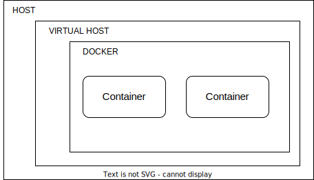
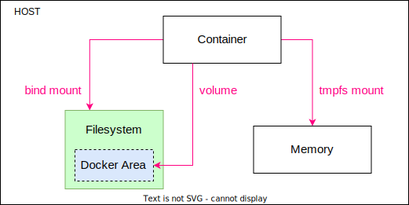

# Capítulo 2: Desplegando contenedores de forma segura

En este capítulo centraremos los esfuerzos en como mantener nuestros contenedores corriendo de forma segura en nuestra máquina(s) siguiendo recomendaciones de seguridad y de buenas prácticas.

Hablaremos de cómo fortificar nuestro host y cómo limitar recursos y permisos en nuestros contenedores. También veremos algunas estrategías sencillas para compartir recursos de forma eficiente con nuestros contenedores.

Así mismo hablaremos en profundidad de cómo podemos hacer uso de las capacidades de Red del demonio de Docker para aislar la comunicación de los contenedores entre sí.


## 2.1  Host

Cuando hablamos de Host nos referimos a cualquier máquina que esté corriendo el demonio de Docker y sea la capa que se interpone entre el demonio y la propia infraestructura.

En muchos entornos productivos, se suelen usar herramientas que permiten la orquestación de contenedores de una forma más sencilla, por ejemplo Kubernetes, Docker Swarm, Openshift... Cada una de esas herramientas tiene su propio enfoque de orquestación de contenedores y sus propias recomendaciones de seguridad y de buenas prácticas. Nosotros en este capítulo queremos centrarnos en un entorno simple y puro, donde solo contamos con el sistema operativo del host y el demonio de Docker para orquestar nuestros contenedores.

Muchas de las recomendaciones y estrategias que veremos a continuación son fácilmente portables a sistemas de orquestación de contenedores.


### 2.1.1 Bastionado

Aunque el bastionado es un proceso ciertamente complejo, podemos plantear al menos dos escenarios bien diferenciados a la hora de trabajar con Docker en entornos de desarrollo modernos (Agile, DevOps…).

Un primer entorno podría ser local. La máquina que se utiliza para las actividades de desarrollo de software, QA, etc.. donde esa máquina suele utilizarse como ordenador personal/trabajo con entorno gráfico, acceso a aplicaciones de mensajería como Slack, etc... y que no se dedica al despliegue de aplicaciones para recibir tráfico de fuera. Este entorno que se suele denominar local es donde más volatilidad y dinamismo tenemos con respecto a los contenedores, ya que los equipos suelen trabajar con diferentes contenedores y relaciones entre ellos, especialmente si se usan microservicios o se desarrollan librerías.

Otro entorno podría ser aquella(s) máquina(s) donde desplegamos los contenedores que esperamos sean estables a lo largo del tiempo y que soporten tráfico de internet o realicen un trabajo productivo definido. Este tipo de entornos suelen ser máquinas específicas que se usan solo para esto y que normalmente suelen ir evolucionando y modificando su estado a lo largo del tiempo, a través de trabajos y pipelines de integración continua o despliegue continuo. En entornos de trabajo moderno solemos encontrarnos al menos con 2 entornos `staging` y `live`. Siendo `live` el más crítico para nuestros objetivos empresariales y de seguridad.


En muchas ocasiones, no prestamos la suficiente atención al entorno local que por su naturaleza distinta para cada individuo, hace que sea difícil de armonizar y bastionar desde un punto de vista IT / CISO. Un primer consejo sería el hacer uso de máquinas virtuales dentro de nuestro entorno local que nos permitan aislar mucho más el impacto de seguridad que pueda tener una mala configuración de Docker en nuestra máquina host.



Además sumariamos esta ventaja adicional, ya que podríamos desplegar esos contenedores en nuestra máquina virtual, compartiendo el mismo sistema operativo de nuestro entorno de `live` o `staging`, evitando así posibles limitaciones de Docker con MacOs o Windows. Obviamente este enfoque nos obliga a tener una máquina con recursos suficientes, y también cierto manejo de máquinas virtuales y su ciclo de vida, así como los volúmenes compartidos o los recursos entre `host <-> virtual host <-> docker <-> container`. Este tipo de enfoque es especialmente interesante cuando queremos tener un entorno más de laboratorio para explorar imágenes de terceros o cuando no confiemos en el contenido de las mismas

Independientemente de usar máquinas virtuales o no, deberemos seguir ciertas recomendaciones.


#### Actualizaciones

Es fundamental mantener nuestro host actualizado tanto el sistema operativo como el demonio de Docker. Históricamente la actualización del demonio de Docker podría arrastrar caídas de servicio ya que los contenedores se paran cuando paramos Docker (para su actualización). Un modo sencillo para evitarlo es hacer uso de la capacidad [live-restore](https://docs.docker.com/config/containers/live-restore/) que no para los contenedores al cerrarse el demonio y que reconecta con ellos una vez se levanta el demonio de nuevo.

```bash
dockered --live-restore
```


#### Antivirus

Cada vez es más común en el mundo empresarial el uso de antivirus. En [la propia documentación de Docker](https://docs.docker.com/engine/security/antivirus/) se menciona que los escaneos sobre las carpetas que usan los contenedores pueden generar errores inesperados. La solución en este caso sería excluir los directorios de Docker pero hacer escáneres cuando los contenedores no están corriendo, usando cron jobs o una planificación adecuada.


### 2.1.2 Gestión de disco

#### Particiones específicas para los contenedores

Aunque Docker cuenta con un sistema bastante eficiente de gestión de las imágenes usando chunks y hashes, es muy habitual que nuestros contenedores ocupen cada vez más y más espacio en disco. Una buena recomendación sería mover la ubicación por defecto que usa Docker para la permanencia en disco `var/lib/docker` a un disco o partición independiente donde podamos hacer un buen mantenimiento y monitoreo del espacio.

#### Purgar Docker regularmente

Por la naturaleza de Docker, y de los contenedores efímeros, es común ocupar el espacio en disco con elementos que ya no son útiles. Una forma de purgar es usando el [comando `prune` de docker](https://docs.docker.com/config/pruning/) y sus diversas variaciones.

Si todos los contenedores y sus elementos relacionados (volúmenes, redes, imágenes..) son prescindibles podemos hacer:

```bash
# Paramos todos los contenedores
docker kill $(docker ps -q)
# Borramos todos los contenedores
docker rm $(docker ps -a -q)
# Purgamos el sistema completamente (incluyendo volúmenes)
docker system prune --volumes
```

### 2.1.3 El poder de root

Si profundizamos en los pilares de Docker ([capítulo 1.2](c01.md#12-los-pilares-de-docker)) es fácil llegar a la conclusión de que en realidad al compartir el kernel si somos `root` en el contenedor también lo somos en el host.

Siendo la premisa siempre evitar la ejecución de un contenedor como `root`. 

> Repeat after me: **“friends don’t let friends run containers as root!”**
> _[Node.js Docker Cheat Sheet](https://cheatsheetseries.owasp.org/cheatsheets/NodeJS_Docker_Cheat_Sheet.html#4-dont-run-containers-as-root)_

#### Root siempre es Root

Si no hacemos nada de forma proactiva o utilizamos un orquestador de contenedores bien configurado, es bastante probable que estemos lanzando los contenedores como root:

```bash
docker run -it busybox
/ # id
uid=0(root) gid=0(root) groups=10(wheel)
```


#### Contenedores  Rootless

Si hacemos uso de [Linux namespaces](https://www.linux.com/news/understanding-and-securing-linux-namespaces/) y [la documentación oficial de Docker](https://docs.docker.com/engine/security/userns-remap/) vemos que ya existen formas para poder ejecutar un contenedor sin ser root. En algunas ocasiones las imágenes que usamos ya definen este comportamiento usando la instrucción `USER` ([capítulo 3.1.2](c03.md#312-privilegios)), pero otras veces no y por ello necesitamos hacer uso del argumento `--user` del demonio de Docker, como veremos a continuación.

Modo non-root (con el usuario `nobody`):

```bash
docker run -it --user nobody busybox
/ # id
uid=65534(nobody) gid=65534(nobody)
```


De todas formas si utilizamos un orquestador como Kubernetes, encontramos que [ya existen mecanismos](https://kubernetes.io/docs/tasks/configure-pod-container/security-context/#set-the-security-context-for-a-pod) que nos permiten gestionar este tipo de casos, simplemente ajustando las especificaciones de seguridad:

```yml
spec:
  securityContext:
    runAsNonRoot: true
```


#### Demonio de Docker Rootless

Desde la versión 19 de Docker, podemos hacer uso del [modo rootless](https://docs.docker.com/engine/security/rootless/) a nivel del demonio y desde la 20 se considera estable. Este modo tiene algunas limitaciones, pero tiene algunas ventajas que no podemos dejar escapar sin más.

Así pues, la forma de instalarlo sería casi idéntica al demonio de Docker convencional (ejecutalo como usuario sin privilegios) aunque tendremos que instalar previamente [otras dependencias](https://docs.docker.com/engine/security/rootless/#prerequisites) como `newuidmap` y `newgidmap`:

```bash
curl -sSL https://get.docker.com/rootless | sh
```

Lo que nos ofrece esta versión del demonio de Docker, es poder ejecutar el demonio bajo un usuario sin privilegios, lógicamente este comportamiento también se extiende a los contenedores que maneja el demonio.

Ahora bien, tiene algunas desventajas que aparecen [al perder los privilegios](https://docs.docker.com/engine/security/rootless/#known-limitations). Como cabría esperarse no se podrá usar `--net=host`, algunos drivers de almacenamiento dejarán de funcionar y además perderemos capacidades de exponer puertos privilegiados (< 1024) entre otras..

Pero no deja de ser una buena opción si no te limita la pérdida de privilegios, especialmente en entornos productivos.


### 2.1.4 Monitorizar

Aún no siendo un entorno productivo, es siempre importante monitorizar nuestros contenedores para detectar anomalías que podrían alertarnos de potenciales vulnerabilidades.

Si contamos con pocos contenedores o no necesitamos una visión a largo plazo siempre podemos hacer uso del comando `stats` de Docker para sacar [las métricas de nuestros contenedores](https://docs.docker.com/config/containers/runmetrics/)

En el [capítulo 4](c04.md) hablamos sobre herramientas que pueden ayudarnos a gestionar múltiples aspectos:
- Con Dockprom ([Capítulo 4.9](c04.md#49-dockprom)) podemos monitorizar nuestros contenedores fácilmente y de una forma visual con Grafana pero además contamos con la posibilidad de incluir alertas
- Con K6 ([Capítulo 4.10](c04.md#410-k6)) podemos fácilmente detectar problemas a la hora de escalar nuestros contenedores, especialmente con servicios web. Para entender la fragilidad a la que nos encontramos, expuestos cuando no hacemos pruebas de carga las vulnerabilidades como [CWE-1333: Inefficient Regular Expression Complexity](https://cwe.mitre.org/data/definitions/1333.html) basadas en una Expresión regular deficiente, pueden provocar una denegación de servicio
- Revisar los logs de nuestros contenedores es también importante ya sea usando los [drivers de Docker](https://docs.docker.com/config/containers/logging/configure/) o alguna solución más compleja.


### 2.1.5 Parches de seguridad

> Security is a process, not a product.
> **Bruce Schneier**

Cuando damos el paso de usar contenedores, añadimos más capas a nuestra infraestructura. Ya que la virtualización es un ladrillo más en la pared que vamos construyendo.

Esto supone un reto a la hora de parchear y actualizar ya que cada parte (Sistema operativo, sistema de orquestación, imágenes, librerías...) deberá ser actualizado de forma frecuente.

Aunque es un proceso que parece sencillo, está intrínsecamente lleno de retos especialmente si estamos manteniendo sistemas arcaicos que hace uso de interfaces antiguas o obsoletas.

Esto se ha convertido en un problema cada vez más importante y ganado importancia en el OWASP top 10 ([A09-2017 Using Components with Known Vulnerabilities](https://owasp.org/www-project-top-ten/2017/A9_2017-Using_Components_with_Known_Vulnerabilities) y [A06-2021 Vulnerable and Outdated Components](https://owasp.org/Top10/A06_2021-Vulnerable_and_Outdated_Components/)) ya que el tiempo pasa y las vulnerabilidades descubiertas siguen creciendo en nuestra contra.

La mejor forma de abordar este tema es darle el peso que se merece y crear un plan sostenible en el tiempo que permita de una forma automatizada nos ayude con la tediosa tarea de actualizar y parchear de una manera frecuente a medida que las vulnerabilidades van apareciendo en nuestro extenso sistema de dependencias.


## 2.2 Contenedores

Los contenedores han supuesto toda una revolución en la experiencia del desarrollo para millones de personas en todo el mundo. A la hora del despliegue tenemos que tener algunos factores en cuenta para mantener un buen aislamiento y control de los recursos que compartimos entre el host y los contenedores, debemos cerciorarnos que las imágenes que utilizamos son de suficiente calidad para nuestros objetivos.


### 2.2.1 Imágenes base

Para crear un contenedor, primero necesitamos una imagen de la que partir. No es necesario crear nosotros mismos las imágenes, ya que en muchas ocasiones encontraremos imágenes ya disponibles en los registros públicos más populares.

Sin ir más lejos Docker Hub cuenta ya con más de 8.3 millones de repositorios, esto hace que elegir una imagen con la que trabajar sea una tarea complicada. Veamos algunos criterios que pueden ayudarnos.

#### Origen confiable

Docker hub divide las imágenes en varias categorías:

- **Imágenes Oficiales (Docker Official Image)**: Son [un conjunto de imágenes que ayudan a la comunidad](https://docs.docker.com/docker-hub/official_images/) bien por ser la base de otras imágenes o por seguir las mejores prácticas, etc... .
- **Publicadores verificados (verified publisher):** Suelen ser imágenes de mucha calidad y cuyos autores forman parte del [programa de verificación de publicadores de Docker](https://docs.docker.com/docker-hub/publish/), normalmente entidades comerciales detras de productos relevantes
- **Programa Open Source (Open Source Program):** Imágenes publicadas y mantenidas por miembros del [Programa Open Source de Docker](https://www.docker.com/community/open-source/application/).
- **Las demás:** Aquellas cuyos autores no forman parte de ningún programa y están normalmente sujetas a [límites de uso](https://www.docker.com/increase-rate-limits/).


Muchas de las imágenes más descargas son imágenes oficiales, por ejemplo [Mongo](https://hub.docker.com/_/mongo), [Nodejs](https://hub.docker.com/_/node), [Python](https://hub.docker.com/_/python), [Mysql](https://hub.docker.com/_/mysql), entre [otras](https://hub.docker.com/search?image_filter=official). Esto no quiere decir que las imágenes no oficiales sean peores o inseguras, simplemente intentaremos priorizar aquellas que sean oficiales. Las imágenes no oficiales incluyen una referencia al usuario por ejemplo `ulisesgascon/check-my-headers` en comparación con las oficiales que no incluyen el usuario, como `busybox`.

#### Popularidad

Otro criterio que puede ayudarnos a decidir entre imágenes similares, es su popularidad. Por regla general cuantas más estrellas tenga un repositorio, más influencia tendrá y más extendido será su uso. Lo que facilitará enormemente la tarea de buscar ayuda o documentación cuando lo necesitemos.

#### Mantenimiento

Tanto si estamos usando imágenes de Docker finales o como base para crear otras, es muy recomendable entender cómo de activo y mantenido está un repositorio. En ocasiones podemos toparnos con imágenes que aunque son populares no están mantenidas de forma activa, introduciendo así un vector de ataque especialmente importante cuando se reportan vulnerabilidades que requieren de un parcheo rápido.

En ocasiones así, es interesante contar con la opción de ser nosotros mismos quienes demos un paso al frente y decidamos mantener esa imagen de Docker.

#### Minimalismo


Cuanto más simple es una imagen de Docker menos superficie de ataque nos ofrece, siendo importante aprender a usar tags más allá de `latest`. Como podemos ver es muy notoria la diferencia:
- `node:18` usa Debian 11 y cuenta con al menos [35 vulnerabilidades críticas](https://snyk.io/advisor/docker/node/18) 
- `node:18-slim` usa Debian 11 y cuenta con solamente [40 vulnerabilidades leves](https://snyk.io/advisor/docker/node/18-slim)
- `node:18-alpine` usa Alpine 3.16.2 y [no cuenta con vulnerabilidades conocidas](https://snyk.io/advisor/docker/node/18-alpine)


Es cierto que no todas las vulnerabilidades potenciales de la imágenes se convierten en vulnerabilidades explotables en nuestros proyectos, pero es importante entender que [usar imágenes vulnerables, nos hace vulnerables](https://snyk.io/blog/top-ten-most-popular-docker-images-each-contain-at-least-30-vulnerabilities/)

>  Docker images almost always bring known vulnerabilities alongside their great value.
>  __Liran Tal__


Otra forma de alcanzar el minimalismo, es hacer uso de imágenes que hagan uso del sistema multi-stage ([ver capítulo 3.1.6](c03.md#316-multi-stage))

#### Tags

La inmutabilidad es uno de los conceptos más importantes del mundo DevOps, y esto se refleja en el uso de tags dentro de Docker. Si estás familiarizado con [el versionamiento semántico](https://semver.org/lang/es/), esto es llevar el proceso un paso más allá. Tomemos como ejemplo [Node](https://hub.docker.com/_/node) `node:<version>-<os>` o [Python](https://hub.docker.com/_/python) `python:<version>-<os>`:

```dockerfile
FROM node:latest
FROM node:18
FROM node:18-slim
FROM node:18-alpine
FROM node:18.1.0-alpine3.15
```

```dockerfile
FROM python:latest
FROM python:3
FROM python:3.10-slim
FROM python:3.10-alpine
FROM python:3.10.5-alpine3.16
```


Como vemos, muchos repositorios en Docker Hub han adoptado este enfoque. En términos de inmutabilidad sobretodo si estamos usando entornos productivos, es necesario definir una política de equipo/empresa en lo referente a la especificidad de las versiones, ya que `node:18-alpine` ahora puede ser `node@18.1.0 & alpine@3.1` pero dentro de tres meses puede ser `node@18.5.0 & alpine@3.1` haciendo que nuestra inmutabilidad no lo sea tanto y acabemos teniendo versiones de nuestro software dispares entre los diversos entornos que manejemos (local, staging, live...) siendo los bugs ocasionados por esta discrepancia bastante difíciles de detectar en muchas ocasiones.


### 2.2.2 Archivos y carpetas

Una de las funcionalidades más populares en el mundo de los contenedores es poder compartir información a nivel de ficheros y carpetas entre el host y los contenedores, siendo esta una actividad de riesgo si no tenemos claro los retos y fortalezas que presentan los volúmenes en Docker.

Tomemos como ejemplo el siguiente código:

```bash
sudo docker run -it -v /:/var/host-hd ubuntu /bin/bash
```

Al ejecutar el ejemplo anterior, estamos usando el usuario root, en principio si somos root en el contenedor también lo somos en host como vimos en el [capítulo 2.1.3](c02.md#213-el-poder-de-root). Además de ello, hemos montado el directorio `/` como `/var/host-hd` en nuestro contenedor de Docker haciendo que sea fácil para el contenedor acceder a información sensible, borrar y modificar ficheros o carpetas. 

Evidentemente este es un caso extremo y ayuda a darnos cuenta lo fácil que resulta exponer información de más con un contenedor y además con demasiados permisos heredados del propio host.

Docker ya introduce bastantes mecanismos para gestionar esto, además cada orquestador suele tener funcionalidades adicionales que nos ayudarán a compartir información de una forma más eficiente y segura.


#### Tipología

Por definición cualquier fichero o carpeta que se genere dentro de un contenedor estará disponible de forma efímera, cuando el contenedor muera esa información desaparecerá.

En caso de necesitar persistencia tendremos que apoyarnos necesariamente en el host, y esto puede hacerse de varias formas:




_Imagen derivada de [Docker](https://docs.docker.com/storage/volumes/) para adaptar el formato_


- **Volumes** se guardan en el host como designe Docker y no debería de usarse fuera del contexto de los contenedores
- **Bind mounts** son ficheros o carpetas (incluyendo información sensible) que se montan directamente en el contenedor. El contenedor puede modificar estos ficheros y carpetas en muchos casos
- **tmpfs** son ficheros y carpetas que usan solamente la memoria del host y no hacen uso del sistema de ficheros. 

Lectura recomendada: [Manage data in Docker](https://docs.docker.com/storage/)

#### Modo lectura

Una forma efectiva de evitar la modificación de archivos en el host es hacer uso del modo solo-lectura cuando sea posible (ver `:ro`)

```bash
docker run -d -it -v /host_folder:/app:ro ubuntu
```


### 2.2.3 Gestión de secretos

Es muy frecuente que tengamos que compartir información sensible con nuestros contenedores, sobre todo en entornos productivos.

Esta información sensible puede ser desde pequeños artefactos como una llave privada o simples cadenas de texto que pueden contener contraseñas, tokens, etc.

Este tipo de información puede ser bastante sensible sobre todo si compartimos un token que permita el acceso a recursos clave fuera de nuestra red como un token de AWS con demasiados permisos o las credenciales para acceder nuestra base de datos de un entorno productivo.

Evidentemente, antes de compartir cualquier secreto deberemos de confiar que nuestra imagen es de confianza, siguiendo las recomendaciones del [capítulo 2.1.1](c02.md#211-bastionado) y del resto del libro. Aunque no es muy frecuente, cada vez más podemos encontrar [contenedores maliciosos en Docker Hub](https://blog.aquasec.com/supply-chain-threats-using-container-images) de los que podríamos ser víctimas potenciales.

Por supuesto, si almacenamos los secretos dentro de nuestras imágenes tendremos un problema ya que ese secreto será visible y extraíble con herramientas como Dive ([capítulo 4.3](c04.md#43-dive)), además dificultará enormemente su rotación, etc...

Una forma común de pasar secretos es mediante las variables de entorno haciendo posible que el secreto solo pase al contenedor que se ejecuta y no su imagen. 

Podemos pasar las variables de entorno de forma individual con los argumentos `-e` o `--env`, pudiendo incluso hacer uso de variables ya presentes en la máquina host:

```bash
export MYVAR1=value1
docker run -e MYVAR1 --env MYVAR2=value2 ubuntu bash
```

O haciendo uso de un fichero específico tipo `.env` con el argumento `--env-file`.

```bash
cat .env
# This is a comment
MYVAR1=value1
MYVAR2=value2

$ docker run --env-file .env ubuntu bash
```

Este sistema tiene ciertas limitaciones que debemos conocer. Por un lado cualquier persona con acceso al contenedor podrá acceder a los secretos.

```bash
# El el host:
docker run -it --rm --name ubuntu -e MYSECRET=el_gran_secreto ubuntu /bin/bash
# Dentro del contenedor:
env | grep MYSECRET
#MYSECRET=el_gran_secreto
```

Por otro lado si hacemos uso de comandos como [`inspect` de docker](https://docs.docker.com/engine/reference/commandline/inspect/) podremos acceder a la misma información

```bash
docker inspect ubuntu -f "{{json: .Config.Env}}"
# ["MYSECRET=el_gran_secreto", ...]
```

Además, este sistema también es proclive a generar la exposición accidental de información sensible en nuestros logs, [CWE-532: Insertion of Sensitive Information into Log File](https://cwe.mitre.org/data/definitions/532.html). Aunque esto dependerá enormemente de cómo hagamos esa configuración/centralización de logs.

Las variables de entorno son un mecanismo de mucha utilidad, pero para cierta información sensible en ocasiones necesitaremos otra estrategia. Una forma de mitigar este problema sería hacer uso de volúmenes ([capítulo 2.2.2](c02.md#222-archivos-y-carpetas)) o de Buildkit ([capítulo 3.1.8](c03.md#318-buildkit)). En entornos productivos debemos de confiar en los mecanismos que nos ofrecen los sistemas de orquestación de contenedores que usemos, por ejemplo con [Docker Swarm](https://docs.docker.com/engine/swarm/secrets/) o  [Kubernetes](https://kubernetes.io/es/docs/concepts/configuration/secret/).

Como opción adicional, Docker Compose ([capítulo 4.1](c04.md#41--docker-compose)) nos ofrece mayor comodidad al lidiar con volúmenes, ficheros tipo `.env` y variables de entorno, especialmente para uso local.

### 2.2.4 Redes

Sin duda uno de las funcionalidades más revolucionarias de Docker ha sido la facilidad con la que podemos gestionar la comunicación entre contenedores y el propio host mediante el uso de `network`.

La securización, aprovisionamiento y bastionado de redes es un tema en sí muy complejo que no está incluido en los objetivos de este libro, pero es importante remarcar algunos conceptos importantes a la hora de entender la seguridad de nuestros contenedores.

Cuando usamos orquestadores en entornos productivos, estos ya suelen incluir diversas formas de conectar y securizar los contenedores entre sí, y las formas de establecer subredes y mecanismos de comunicación seguros y eficaces.

Pero si usamos el demonio de docker en nuestro entorno local debemos tener varias cosas en consideración.

#### La configuración por defecto
Algo que no se hace tan obvio en un primer vistazo en docker es que los contenedores pueden comunicarse entre sí aunque los puertos no hayan sido específicamente publicados o expuestos ya que usan `bridge` network por defecto.

Veamos un ejemplo ilustrativo con Nginx y busybox:
```bash
# Arrancamos Nginx
docker run --rm --name nginx-server --detach nginx

# Sacar la IP del Nginx (p.j: 172.17.0.2)
docker inspect nginx-server| grep IPAddress

# Arrancamos busybox y entramos en su terminal
docker run -it busybox sh

# hacemos un GET al Nginx
wget -q -O - 172.17.0.2:80
#<!DOCTYPE html>
#...
```

Una forma de evitar esto, es modificando el comportamiento del demonio de Docker usando el argumento `--icc=false`

```bash
dockerd --icc=false 
```

Para asegurarnos que el cambio surtió efecto podemos buscar `com.docker.network.bridge.enable_icc:false` en las redes de docker disponibles

```bash
docker network ls --quiet | xargs docker network inspect --format '{{ .Name }}: {{ .Options }}'
```


#### Abusando de host

Una posibilidad que nos ofrece Docker es hacer uso de la red de la propia máquina host `--network=host`  compartiendo así la red.

Al hacer esto, es fácil acabar exponiendo la máquina host a través de los contenedores si estos tienen alguna vulnerabilidad explotable.

Como ejemplo ilustrado de este tipo de ataques podemos leer este didáctico writeups como [How to contact Google SRE: Dropping a shell in cloud SQL](https://offensi.com/2020/08/18/how-to-contact-google-sre-dropping-a-shell-in-cloud-sql/) o [Metadata service MITM allows root privilege escalation (EKS / GKE)](https://blog.champtar.fr/Metadata_MITM_root_EKS_GKE/)


#### Uso de Link

Es común hoy en día encontrar referencias sobre el uso del [argumento link](https://docs.docker.com/network/links/) cuando queramos que los contenedores puedan comunicar entre sí de forma explícita. A día de hoy, la idea sería portarnos al uso de `network`.

#### Establecimiento de redes

Docker hace uso del _Container Network Model (CNM)_ que nos permite crear pequeñas redes segmentadas donde podemos hacer mejor control de los recursos, dejando así abierta la posibilidad de ir aislando y conectando elementos entre sí de una forma más segura.

Este trabajo es infinitamente más simple si hacemos uso de Docker Compose ([capítulo 4.1](c04.md#41--docker-compose)) cuando tengamos que montar comunicaciones entre varios contenedores en el entorno local.

Lectura recomendada: [Practical Design Patterns in Docker Networking de Dan Finneran](https://www.youtube.com/watch?v=PpyPa92r44s)

### 2.2.5 Limitación de recursos

Como en cualquier escenario de virtualización debemos preocuparnos de una forma proactiva y consciente del uso y sobre todo del mal uso de los recursos del sistema. 

Los contenedores consumen los recursos que el host ofrece a través del demonio de Docker, permitiendo así también limitar esos recursos para evitar ataques tipo DOS (ver [CWE-400: Uncontrolled Resource Consumption](https://cwe.mitre.org/data/definitions/400.html)) o que se comprometa la integridad del host por un memory leak en uno o varios contenedores.

Los orquestadores de contenedores en sistemas productivos suelen tener también mecanismos que podemos utilizar para poner límites a nuestros contenedores, algunos incluso proveen interfaces más avanzadas que las del propio demonio de Docker.

#### Limitar los reinicios

Docker ofrece la posibilidad de definir las políticas de reinicio con [el argumento `--restart`](https://docs.docker.com/config/containers/start-containers-automatically/) evitando así la interrupción de servicio. Esto es especialmente útil si contamos con un sistema de escalado horizontal como en [el caso de Kubernetes](https://kubernetes.io/docs/tasks/run-application/horizontal-pod-autoscale/)

La política más relevante a la hora de limitar recursos sería `on-failure` que nos permite limitar el número de reinicios máximos que permitimos a una imagen. En este ejemplo especificamos que 10 sería el máximo permitido.

```bash
docker run -d --restart on-failure:10 ubuntu
```

Evidentemente si una imagen ha terminado su tarea y decide cerrarse según se espera ([código de salida 0](https://www.redhat.com/sysadmin/exit-codes-demystified#:~:text=An%20exit%20code%20is%20a,asks%20it%20to%20do%20so.)) esta no será reiniciada.

Existen varias convenciones adicionales que deberemos tener presentes a la hora de entender como Docker aplica [las políticas de reinicio](https://docs.docker.com/config/containers/start-containers-automatically/#restart-policy-details). A su vez es interesante entender el papel que juegan los health checks en Docker, de lo que hablaremos en el [capítulo 3.1.9](c03.md#319-health-checks).

También es importante remarcar que para poner límites a nuestros contenedores previamente tendremos que saber cuántos recursos necesita para funcionar de una forma correcta, siendo una primera opción utilizar herramientas como Dockprom ([capítulo 4.9](c04.md#49-dockprom)). Podemos hacer pruebas sin parar los contenedores para probar límites nuevos de CPU/Memoria ya que el comando [`update` de Docker](https://docs.docker.com/engine/reference/commandline/update/) nos permite esa flexibilidad

```bash
# A un contenedor específico
docker update --cpuset-cpu ".5" --memory "500m" <ContainerNameOrID>

# A todos:
docker update --cpuset-cpus "1.5" --memory "350m" $(docker ps | awk 'NR>1 {print $1}')
```

Una forma interactiva de familiarizarnos con los límites en Docker es hacer uso de la imagen [progrium/stress](https://hub.docker.com/r/progrium/stress/) que ya nos provee una versión dockerizada de [Stress](https://software.opensuse.org/package/stress).

#### Limitar CPU

La limitación de uso de CPU se puede hacer con diversos argumentos `--cpus`, `--cpu-period`, `--cpu-quota`, `--cpuset-cpus`, `--cpu-shares` lo que permite mucha flexibilidad.

En este ejemplo veremos cómo permitimos el uso de 1 CPU de dos formas equivalentes:

```bash
docker run -it --cpus="1" ubuntu /bin/bash
docker run -it --cpu-period="100000" --cpu-quota="100000" ubuntu /bin/bash
```

#### Limitar memoria

En sistemas Linux es fácil que acabemos con una excepción `Out of Memory Exception (OOME)` si nuestros contenedores llegan a comprometer la memoría mínima necesaria para que el host sobreviva. Esto hace que Docker suba su prioridad (OOM Priority) haciendo que sea más fácil terminar con un contenedor que con el propio demonio de Docker. Lectura recomendada: [Kernel: Out Of Memory Management](https://www.kernel.org/doc/gorman/html/understand/understand016.html) y [Kernel: Memory Resource Controller](https://www.kernel.org/doc/Documentation/cgroup-v1/memory.txt)

#### Ram

Podemos limitar el uso de memoria RAM siendo lo mínimo `6m` pudiendo llegar a varios Gigas sin problema

```bash
docker run -it --memory="1g" ubuntu /bin/bash
```

#### Swap

La memoria Swap nos permite usar espacio del disco duro como memoria en lugar de usar RAM directamente. Esto es muy útil si no tenemos mucha memoria RAM, pero el tener que acceder al disco hace que la aplicación sea [mucho más lenta](https://haydenjames.io/linux-performance-almost-always-add-swap-space/).


_Imagen derivada de [Thorsten Hans](https://www.thorsten-hans.com/limit-memory-for-docker-containers/) para adaptar el formato_


Solo podemos configurar Swap si tenemos el argumento de `--memory` ya habilitado. Por defecto Docker igualará la memoria que especifiquemos en Swap. Haciendo así que la suma de `ram+swap` sea el doble que la ram que definimos.

Al combinar  `--memory` y `--memory-swap` podemos llegara varios escenarios interesantes, veamos algunos ejemplos:

```bash
# Swap: 256m. Ram: 256mb. Total: 256mb + 256mb
docker run --memory="256m" ubuntu /bin/bash

# Swap: 1G. Ram: 256mb. Total: 1G + 256mb
docker run --memory="256m" --memory-swap="1g" ubuntu /bin/bash

# Swap: ilimitado. Ram: 256mb. Total: ? + 256mb 
docker run --memory="256m" --memory-swap -1 ubuntu /bin/bash

# Swap: 0. Ram: 256mb. Total: 0 + 256mb
docker run --memory="256m" --memory-swap="256m" ubuntu /bin/bash
```


#### Otras limitaciones

En escenarios un poco más específicos contamos con la posibilidad de crear limitaciones para uso de [GPUs](https://docs.docker.com/config/containers/resource_constraints/#gpu) y de la memoria del [Kernel](https://docs.docker.com/config/containers/resource_constraints/#--kernel-memory-details).

Cuando contamos con orquestadores ciertas tareas de limitación son más sencillas como la del propio demonio de Docker o del consumo de red especialmente útil en escenarios P2P o IPFS, pero en red local entrañan ciertas dificultades técnicas y deberemos de investigar formas de mitigarlo de una forma efectiva.


## 2.3 Conceptos Avanzados

### 2.3.1 USBs y otros dispositivos

Docker nos ofrece con el argumento `--device` la posibilidad de trabajar con comunicación serial de una forma efectiva. Para ello deberemos conectar el dispositivo (memorias, arduinos, sistemas embebidos, smartphones...) a la máquina anfitrión y después lanzar nuestro contenedor de Docker.

En este ejemplo conectamos un dispositivo en la máquina anfitrión al puerto `/dev/ttyUSB0` y permitimos el acceso desde el contenedor de Docker.

```bash
docker run -t -i --device=/dev/ttyUSB0 ubuntu bash
```

Evidentemente la máquina anfitrión estará expuesta a ese dispositivo y por ello debemos seguir las mismas políticas habituales al trabajar con [dispositivos USB](https://www.cisa.gov/tips/st08-001) y entender que Docker no nos ofrece una protección adicional en este aspecto a nivel de seguridad y que seguimos exponiendo nuestra máquina anfitrión al dispositivo que hayamos conectado. 


### 2.3.2 Permisos para los ficheros de configuración del demonio de Docker

Es una buena estrategía reducir los permisos de los ficheros y carpetas que hace uso el demonio de Docker. En la siguiente tabla podemos ver la configuración inicial recomendada por Docker, pero sería interesante intentar en la medida de lo posible reducir aún más esos permisos.

| Recurso | Usuario:Grupo | Permisos |
|----------|:-------------:|------:|
| `/etc/default/docker` | root:root| 644 |
| `/etc/docker` (directory) | root:root| 755 |
| `/etc/sysconfig/docker` | root:root| 644 |
| `daemon.json` | root:root| 644 |
| Docker server certificate | root:root| 444 |
| Docker server certificate key | root:root| 400 |
| Docker socket | root:docker | 660 |
| docker.service | root:root | 644 |
| docker.socket | root:root | 644 |
| Registry certificate | root:root | 444 |
| TLS CA certificate | root:root | 444 |


### 2.3.3 Verificar las imágenes

Por defecto el demonio de Docker nos permite descargarnos cualquier imagen que esté disponible dentro de un registro válido. Esta funcionalidad puede convertirse rápidamente en un problema si no podemos confiar en la autoría y la integridad del contenido por el canal de comunicación que usamos.

Para mitigar este tipo de escenarios podemos hacer uso de la validación de imágenes que incluye [el propio demonio de Docker](https://docs.docker.com/engine/security/trust/) de la siguiente forma:

```bash
export DOCKER_CONTENT_TRUST=1
```

Desde este momento el demonio de Docker solo permitirá descargar aquellas imágenes que estén firmadas por sus autores a través del mecanismo de Notary que ofrece Docker.

En ocasiones tendremos otros entornos auto hosteados o similar y necesitamos definirlo de forma explícita de la siguiente forma:

```bash
export DOCKER_CONTENT_TRUST_SERVER=https://<URL>:<PORT>
```


### 2.3.4 Blindando el Daemon Socket

Es común que nos encontremos escenarios donde necesitemos exponer el Socket del demonio para que una aplicación pueda gestionar nuestros contenedores. Por ejemplo cuando hacemos uso de Portainer ([capítulo 4.2](c04.md#42-portainer)), donde se nos pide que hagamos un bindeo entre el socket del host y el del contenedor de Portainer `-v /var/run/docker.sock:/var/run/docker.sock`.

Este paso hace que nuestro contenedor tome el control de los contenedores que está gestionando la máquina anfitrión, si confiamos en el software en el que estamos delegando esto no debería ser un problema, pero cuando esta relación ocurre fuera de la máquina anfitrión y por ejemplo queremos controlar el Socket de una máquina remota debemos ser proactivos y garantizar la comunicación a traves de [SSH](https://docs.docker.com/engine/security/protect-access/#use-ssh-to-protect-the-docker-daemon-socket) o [TLS (HTTPS)](https://docs.docker.com/engine/security/protect-access/#use-tls-https-to-protect-the-docker-daemon-socket)

### 2.3.5 Privilegios y capacidades

Hace algunos años [se decidió granularizar el poder de Root](https://mirrors.edge.kernel.org/pub/linux/libs/security/linux-privs/kernel-2.2/capfaq-0.2.txt) y dividirlo en una serie de capacidades que pueden ser activadas o desactivadas de forma independiente, esto se conoce como [capabilities](https://man7.org/linux/man-pages/man7/capabilities.7.html).

Docker nos ofrece una interfaz con tres argumentos para poder gestionarlo `--privileged`, `--cap-drop`, `--cap-add`. 

En general el uso de `--privileged` es altamente desaconsejado porque concede todas las capacidades sin restricciones, son muy pocos los casos donde esto tenga una justificación real en un entorno productivo.

[Carlos Polop](https://book.hacktricks.xyz/welcome/about-the-author) de [HackTricks](https://book.hacktricks.xyz/welcome/readme) presenta uno de [los ejemplos más ilustrativos de lo fácil que resulta escalar privilegios rápidamente](https://book.hacktricks.xyz/linux-hardening/privilege-escalation/docker-breakout/docker-breakout-privilege-escalation#escape-from-privileged-containers) cuando no entendemos bien el alcance de `--privileged`

```bash
docker run --rm -it --privileged ubuntu bash
$ fdisk -l
#....
$ mkdir -p /mnt/hola
$ mount /dev/sda1 /mnt/hola
```

En realidad estamos permitiendo montar el volumen `/dev/sda1` del host como `/mnt/hola` en el contendor porque implícitamente hemos permitido esas capacidades al usar `--privileged`.

Una forma más moderna de enfocar las capacidades desde el punto de vista de la seguridad sería retirar todos los permisos de forma completa e ir gradualmente aperturando aquellos que sean estrictamente necesarios.

Un ejemplo sería este, donde quitamos todas las capacidades para finalmente permitir `kill` haciendo que un proceso que no es dueño de otro puedo terminar la ejecución:

```bash
docker run -d --cap-drop=all --cap-add=kill ubuntu /bin/bash
```

### 2.3.6 Políticas con AppArmor 

[AppArmor es un módulo de seguridad de Linux](https://apparmor.net/) disponible desde la versión 2.6.36 del Kernel y que nos permite definir políticas que luego podemos agrupar en perfiles y vincularlos a la ejecución de programas.

Docker aplica por defecto una política moderada pensada de forma que no rompa la compatibilidad con la gran diversidad de imágenes disponibles. [Esta política](https://docs.docker.com/engine/security/apparmor/) se conoce como `docker-default`.

Podemos hacer uso del argumento `--security-opt` para cargar otras políticas más restrictivas y acordes a los proyectos que tenemos entre manos. 

En la propia [documentación de Docker](https://docs.docker.com/engine/security/apparmor/#nginx-example-profile) podemos encontrar un ejemplo bastante extenso sobre Nginx

### 2.3.7 Políticas Seccomp

[Seccomp](https://man7.org/linux/man-pages/man2/seccomp.2.html) es una funcionalidad del Kernel de Linux que permite establecer políticas sobre las llamadas que un proceso puede realizar al sistema.

Docker aplica por defecto [una política moderada](https://github.com/moby/moby/blob/master/profiles/seccomp/default.json) que bloquea activamente 44 de las más de 300 directivas disponibles. 

Podemos hacer uso del argumento `--security-opt` también en este caso para cargar políticas personalizadas.

En la propia [documentación de Docker](https://docs.docker.com/engine/security/apparmor/#nginx-example-profile) podemos encontrar un ejemplo bastante extenso sobre Nginx

```bash
docker run --rm -it --security-opt seccomp=/politica-personalizada.json ubuntu
```
