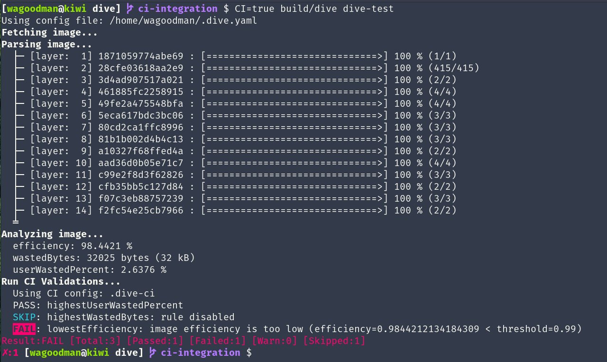
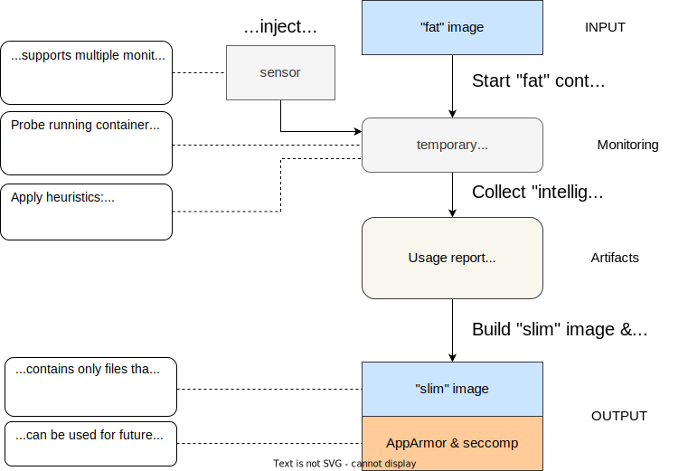
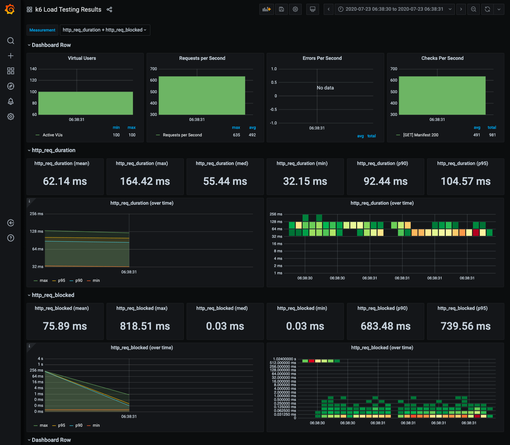

# Capítulo 4: Herramientas

En este capítulo encontrarás un conjunto de herramientas recomendadas que hemos mencionado a lo largo del libro o que consideramos de especial relevancia.

Recordemos que en el ecosistema de Docker existen infinidad de herramientas, una forma de buscar nuevas herramientas o alternativas es en [veggiemonk/awesome-docker](https://github.com/veggiemonk/awesome-docker)

## 4.1  Docker compose

A medida que introducimos Docker en nuestro entorno de desarrollo, nos damos cuenta que rápidamente estamos en un escenario donde tenemos que orquestar múltiples contenedores a la vez por ejemplo: base de datos, backend, frontend, cache...

Para agilizarnos el proceso podemos hacer uso de [Docker Compose](https://docs.docker.com/get-started/08_using_compose/#:~:text=Docker%20Compose%20is%20a%20tool,or%20tear%20it%20all%20down.) una herramienta muy elegante que nos permite pasar de comandos como:

```bash
docker run -p 80:80 -v /var/run/docker.sock:/tmp/docker.sock:ro --restart always --log-opt max-size=1g nginx
```

a ficheros yml mucho mas sencillos y legibles como:
```yml
version: '3.3' 
services: 
    nginx: 
        ports: 
            - '80:80' 
        volumes: 
            - '/var/run/docker.sock:/tmp/docker.sock:ro'
        restart: always 
        logging: 
            options: 
                max-size: 1g 
        image: nginx
```

Además podemos tener múltiples servicios corriendo y conectados entre sí con las políticas de red que nosotros queramos. Por ejemplo un  [Wordpress rápido y sencillo para hacer pruebas en local con MariaDB](https://docs.docker.com/samples/wordpress/)

```yml
version: '3.3'
services:
  db:
    # We use a mariadb image which supports both amd64 & arm64 architecture
    image: mariadb:10.6.4-focal
    # If you really want to use MySQL, uncomment the following line
    #image: mysql:8.0.27
    command: '--default-authentication-plugin=mysql_native_password'
    volumes:
      - db_data:/var/lib/mysql
    restart: always
    environment:
      - MYSQL_ROOT_PASSWORD=somewordpress
      - MYSQL_DATABASE=wordpress
      - MYSQL_USER=wordpress
      - MYSQL_PASSWORD=wordpress
    expose:
      - 3306
      - 33060
  wordpress:
    image: wordpress:latest
    ports:
      - 80:80
    restart: always
    environment:
      - WORDPRESS_DB_HOST=db
      - WORDPRESS_DB_USER=wordpress
      - WORDPRESS_DB_PASSWORD=wordpress
      - WORDPRESS_DB_NAME=wordpress
volumes:
  db_data:
```

También podemos incluir [variables de entorno](https://docs.docker.com/compose/environment-variables/), que además tiene sus [propios comandos y sintaxis](https://devhints.io/docker-compose) que nos ayudan a gestionar el ciclo de vida de nuestros contenedores de una forma fácil e intuitiva.

Una forma fácil de empezar es simplemente migrando comandos de Docker que ya usamos en el día a día con la herramienta online [Composerize](https://www.composerize.com/)


## 4.2 Portainer

[Portainer](https://www.portainer.io/) es una de las herramientas esenciales para la orquestación de contenedores en entornos locales, principalmente aunque también productivos. Tiene una curva de aprendizaje muy suave en comparación con Kubernetes y cuenta con una interfaz web completa donde se pueden visualizar nuestros contenedores, volúmenes, redes, etc... 

Es una forma sencilla y rápida sobre todo para acelerar la adopción de contenedores y nube pública en procesos de transformación digital o para empezar un homelab.

Evidentemente si lo usamos en entornos productivos deberemos de securizarlo a no ser que utilicemos la `Business Edition`

Portainer `Community Edition` ya viene dockerizado así que los haremos funcionar como un contenedor más que además de pasarle volúmenes y comunicar puertos le pasaremos el socket de Docker para que pueda orquestar los demás contenedores.

```bash
docker run -d -p 8000:8000 -p 9443:9443 --name portainer --restart=always -v /var/run/docker.sock:/var/run/docker.sock -v portainer_data:/data portainer/portainer-ce:latest
```

## 4.3 Dive

[Dive](https://github.com/wagoodman/dive) nos permite adentrarnos de una manera cómoda en las diversas capas que componen una imagen de Docker siendo especialmente útil para buscar secretos o cambios entre capas.

Incluso podemos utilizarlo en sistemas de integración continua ([sección 4.12](c04.md#412-integración-continua)) para validar la eficiencia de nuestras imágenes


_Imagen cortesia de [Dive](https://github.com/wagoodman/dive)_

## 4.4 Open Policy Agent (OPA)

Para escenarios donde buscamos el poder crear un entorno de desarrollo muy dogmático podemos hacer uso de políticas. Gracias a [Open Policy Agent (OPA)](https://www.openpolicyagent.org/) podemos definir políticas uniformes en diferentes plataformas (aplicaciones, agentes, k8s, docker..) y asegurarnos que las políticas se cumplen haciendo uso de CI u otras herramientas adicionales.

## 4.5 Snyk 

[Snyk](https://snyk.io/) es una plataforma completa pensada para personas que se dedican al desarrollo de software y que ofrece varias soluciones que podemos utilizar para analizar, escanear y monitorizar nuestros proyectos a varios niveles ([dependencias](https://snyk.io/product/open-source-security-management/), [análisis de código SAST](https://snyk.io/product/snyk-code/), [contenedores](https://snyk.io/product/container-vulnerability-management/), [infraestructura como código](https://snyk.io/product/infrastructure-as-code-security/)).

Nos permite escanear imágenes de Docker en busca de vulnerabilidades:

```bash
snyk container test hello-world
```

O incluso suscribirnos (monitorizando) una o varias imágenes que usemos, para así ser alertados cuando se publique una nueva vulnerabilidad en nuestras dependencias

```bash
snyk container monitor hello-word
```


Al igual que el propio Docker con [su comando `scan`](https://docs.docker.com/engine/scan/) que hace uso de Snyk para escanear nuestras imágenes (ofreciendo 10 escaneos sin autenticación).


```bash
docker scan hello-world
```

También es útil para escanear las dependencias de nuestros propios proyectos a nivel de librerías, ya que Snyk cuenta con una base de datos abierta de vulnerabilidades.

Una de las formas más recomendadas de hacer uso de Snyk es a través de sus [plugins para integración continua](https://docs.snyk.io/integrations/ci-cd-integrations) ya que de manera proactiva analizará el repositorio cuando detecte cambios y nos alertará cuando nuevas vulnerabilidades se publiquen incluso proponiendo cambios en el código.


## 4.6 Hadolint

[Hadolint](https://github.com/hadolint/hadolint) nos ofrece un linter completo con un conjunto de [reglas sólidas y bien definidas](https://github.com/hadolint/hadolint#rules). Lo que reduce la necesidad de recordar todas las buenas prácticas, sobre todo cuando no usamos Docker a diario o añadimos nuevas personas al equipo.

Las reglas pueden [modificarse fácilmente](https://github.com/hadolint/hadolint#configure) para adaptarse a las convenciones del equipo.

Y podemos consumirlo como un contenedor al que le pasamos el `Dockerfile` que queramos revisar:

```bash
docker run --rm -i hadolint/hadolint < Dockerfile
```


## 4.7 Dockle

[Dockle](https://github.com/goodwithtech/dockle) es un linter similar en objetivos a Hadolint ([sección 4.6](c04.md#46-hadolint)) pero que incluye [funcionalidades extra](https://github.com/goodwithtech/dockle#checkpoints-comparison) como la auditoría de seguridad, ya que se basa en imágenes de contenedores y no en `Dockerfile`. A la hora de [instalarlo](https://github.com/goodwithtech/dockle#installation) y [usarlo](https://github.com/goodwithtech/dockle#quick-start) tenemos más pasos.

Este sería la forma de usarlo como un contenedor:

```bash
$ export DOCKLE_LATEST=$(
 curl --silent "https://api.github.com/repos/goodwithtech/dockle/releases/latest" | \
 grep '"tag_name":' | \
 sed -E 's/.*"v([^"]+)".*/\1/' \
)
$ docker run --rm goodwithtech/dockle:v${DOCKLE_LATEST} [YOUR_IMAGE_NAME]
```

Si quisiéramos utilizar imágenes que solo existen en nuestra máquina deberíamos conectar el Socket de Docker.

```bash
$ docker run \
    -v /var/run/docker.sock:/var/run/docker.sock \
    --rm goodwithtech/dockle:v${DOCKLE_LATEST} \
    [YOUR_IMAGE_NAME]
```


## 4.8 Docker-slim

[Docker-slim](https://github.com/docker-slim/docker-slim) nos permite reducir el tamaño de nuestra imagen de Docker enormemente ya que utiliza un [algoritmo](https://github.com/docker-slim/docker-slim#optimize-your-experience-with-containers-make-your-containers-better-smaller-more-secure-and-do-less-to-get-there-free-and-open-source) muy efectivo para lograrlo. Además de reducir considerablemente el tamaño de la imagen final (hasta 30 veces) nos ofrece un conjunto de herramientas para entender en detalle este proceso y permitirnos influir en él.



_Imagen derivada de [Docker-slim](https://github.com/docker-slim/docker-slim) para adaptar el formato_

Además de la reducción de tamaño nos ofrece una capa de seguridad adicional gestionando por nosotros AppArmor y Seccomp

Una vez instalado en nuestra máquina podemos hacer una build de la imagen:

```bash
docker-slim build my-company/my-app
```

## 4.9 Dockprom

[Dockprom](https://github.com/stefanprodan/dockprom) es una solución fantástica cuando necesitamos poder monitorizar nuestros contenedores, especialmente en el entorno local, ya que con poco esfuerzo podemos tener una solución de monitorización que incluye [Prometheus](https://prometheus.io/), [Grafana](http://grafana.org/), [cAdvisor](https://github.com/google/cadvisor),
[NodeExporter](https://github.com/prometheus/node_exporter) y alertas con [AlertManager](https://github.com/prometheus/alertmanager).

Se instala de forma simple (clonamos y desplegamos el Docker-compose) además podemos cambiar los usuarios y passwords por defecto [fácilmente](https://github.com/stefanprodan/dockprom/blob/master/README.md#install).

```bash
git clone https://github.com/stefanprodan/dockprom
cd dockprom

ADMIN_USER=admin ADMIN_PASSWORD=admin ADMIN_PASSWORD_HASH=JD...ZP docker-compose up -d
```

Es bastante común que encontremos forks de este proyecto con customizaciones específicas como [Promstack](https://github.com/paaacman/promstack) que resolvería el tema de logging con [Loki](https://grafana.com/oss/loki/).


## 4.10 K6

[K6](https://k6.io/) es una de las mejores herramientas disponibles para hacer pruebas de carga usando Javascript como lenguaje para hacer nuestros scripts. Tiene mucho soporte de la comunidad haciendo que las pruebas de carga puedan hacerse más allá de servidores http.

Una forma de hacer uso de ello es desde el proyecto [ulisesgascon/PoC-Load-test](https://github.com/UlisesGascon/PoC-Load-test) que ya incluye una versión dockerizada junto a [Grafana](http://grafana.org/) para tener dashboard más detallados de las pruebas de carga.




## 4.11 Docker Bench for Security
[Docker Bench for Security](https://github.com/docker/docker-bench-security) es un script que aglutina decenas de chequeos para verificar que seguimos las recomendaciones y de buenas prácticas para el uso de docker en entornos productivos. El conjunto de chequeos se realizan en formas de tests siguiendo el [CIS Docker Benchmark v1.4.0](https://www.cisecurity.org/benchmark/docker/).

Puede ser instalado [en la máquina host](https://github.com/docker/docker-bench-security#run-from-your-base-host) o ejecutado como [imagen de docker](https://github.com/docker/docker-bench-security#run-with-docker)


## 4.12 Integración continua

Es muy común que usemos un sistema de control de versiones para mantener los cambios de nuestros proyectos y sus releases de una forma estable y predecible.

Las imágenes de Docker no son una excepción a esta regla, lo que a su vez nos brinda la oportunidad de hacer uso de los diversos sistemas de integración continua para automatizar muchas de nuestras tareas como por ejemplo la publicación de imágenes en registros públicos o privados, revisión automática de las dependencias, etc...

Las posibilidades son infinitas, a su vez nos permite una gestión más óptima de los tokens, api keys y secretos que manejamos a nivel de la organización, evitando así la necesidad de compartir tokens con personas individuales, facilitando así la rotación de los mismos.


### Veamos unos ejemplos

En esta ocasión usaremos Github Actions, pero fácilmente podría portarse a otros sistemas de CI sin mucho esfuerzo.

Imaginemos que tenemos un simple "Hola mundo" en un fichero `./src/server.js` y su correspondiente `package.json` con las dependencias y [típicos scripts de Npm (start, test, lint...)](https://github.com/UlisesGascon/useful-npm-scripts/blob/main/package.json#L6)

```js
const express = require('express')

const app = express()

const PORT = 8080; 
const HOST = '0.0.0.0';

app.get('/', (req, res) => {
    res.send('Hola mundo!')
})

app.listen(PORT, HOST () => {
    console.log('Listening on port ${PORT}}...')
})
```

Luego hacemos un Dockerfile siguiendo las buenas prácticas (multi-stage, gestión de privilegios, crear una imagen final liviana, metadatos...)

```
# Fase 1: dependencies

FROM node:14.15.5 as dependencies
WORKDIR /usr/src/app
COPY package*.json ./
RUN npm i --only=production

# Fase 2: Imagen final
FROM node:14.15.5-alpine

# Distribution details.
ARG BUILD_DATE  
ARG VCS_REF  
ARG BUILD_VERSION

# Labels.  
LABEL org.label-schema.schema-version="1.0"  
LABEL org.label-schema.build-date=$BUILD_DATE  
LABEL org.label-schema.name="ulisesgascon/hello-world-sample"  
LABEL org.label-schema.description="Simple Hello World Sample in Nodejs with Express"  
LABEL org.label-schema.url="https://github.com/ulisesgascon/hello-world-sample"  
LABEL org.label-schema.vcs-url="https://github.com/ulisesgascon/hello-world-sample"  
LABEL org.label-schema.vcs-ref=$VCS_REF  
LABEL org.label-schema.vendor="Ulises Gascon"  
LABEL org.label-schema.version=$BUILD_VERSION  
LABEL org.label-schema.docker.cmd="docker run -p 8080:8080 -d ulisesgascon/hello-world-sample"

WORKDIR /app
RUN chown -R node:node /app
USER node
COPY --from=dependencies /usr/src/app/node_modules ./node_modules
COPY package*.json ./
COPY /src ./src
EXPOSE 8080
CMD [ "npm", "start" ]
```

#### Revisar los cambios

Un flujo bastante común se produciría se creará una nueva pull request. Disparando un workflow que valide específicamente que nuestro `Dockerfile` está pasando un linter como Hadolint y que es capaz de hacer una build sin romperse (incluyendo metadatos).

```yml
name: Check Dockerfile
on: [pull_request]

jobs:
  check-dockerfile:
    runs-on: ubuntu-latest
    steps:
      - name: Check out code
        uses: actions/checkout@v2
      
      - name: Get current time
        uses: josStorer/get-current-time@v2.0.1
        id: current-time

      - name: Linting with hadolint
        uses: reviewdog/action-hadolint@v1
        with:
          reporter: github-pr-review    
                  
      - name: Build the Docker image
        env:
          RELEASE_VERSION: ${{ steps.vars.outputs.tag }}
          BUILD_DATE: ${{ steps.current-time.outputs.time }}
          RELEASE_VERSION: "PR${{github.event.number}}"
        run: |
          docker build . 
          --build-arg BUILD_DATE=${{ env.BUILD_DATE  }}
          --build-arg VCS_REF=${{ github.sha }}
          --build-arg BUILD_VERSION=${{ env.RELEASE_VERSION }}
          --tag ulisesgascon/hello-world-sample:$RELEASE_VERSION 
          --tag ulisesgascon/hello-world-sample:latest          
```

#### Publicar en un registro público
Con unas pocas modificaciones sobre el código anterior podemos hacer la publicación de la imagen de manera pública en [Docker Hub](https://hub.docker.com/) cuando creamos una release en el proyecto.


```yml
name: Publish Docker Image
on: [pull_request]

jobs:
  check-dockerfile:
    runs-on: ubuntu-latest
    steps:
      - name: Check out code
        uses: actions/checkout@v2
      
      - name: Set RELEASE_VERSION
        run: echo "RELEASE_VERSION=${GITHUB_REF#refs/*/}" >> $GITHUB_ENV

      - name: Get current time
        uses: josStorer/get-current-time@v2.0.1
        id: current-time

      - name: Linting with hadolint
        uses: reviewdog/action-hadolint@v1
        with:
          reporter: github-pr-review    
                  
      - name: Build the Docker image
        env:
          RELEASE_VERSION: ${{ steps.vars.outputs.tag }}
          BUILD_DATE: "${{ steps.current-time.outputs.time }}"
        run: |
          docker build . 
          --build-arg BUILD_DATE=${{ env.BUILD_DATE  }}
          --build-arg VCS_REF=${{ github.sha }}
          --build-arg BUILD_VERSION=${{ env.RELEASE_VERSION }}
          --tag ulisesgascon/hello-world-sample:$RELEASE_VERSION 
          --tag ulisesgascon/hello-world-sample:latest

      - name: Docker Hub Login
        env:
          DOCKER_USER: ${{secrets.DOCKER_USER}}
          DOCKER_PASSWORD: ${{secrets.DOCKER_PASSWORD}}
        run: |
          docker login -u $DOCKER_USER -p $DOCKER_PASSWORD

      - name: Docker Hub Publish
        run: docker push --all-tags ulisesgascon/hello-world-sample
```


Nota: debemos incluir los secretos que solicitamos en la configuración del repositorio de Github (`DOCKER_USER` y `DOCKER_PASSWORD` para Docker Hub)
