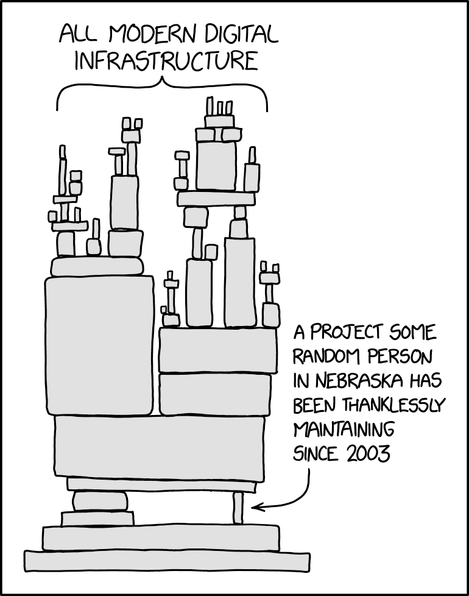

# Conclusiones

En primer lugar, felicidades por haber logrado llegar hasta el final del libro. Espero que hayas disfrutado del aprendizaje y te sirva en tu día a día. Recuerda que puedes seguir formándote en temas relacionados con el mundo de los contenedores. Mi recomendación para el siguiente paso sería intentar entender en profundidad y manejar un orquestador de contenedores como Kubernetes ya que te ayudará a poner en práctica muchos de estos conocimientos.

Como hemos visto a lo largo del libro, los contendores como tecnología vienen para quedarse sea cual sea su forma. Aún quedan muchos años por delante para seguir disfrutando de Docker hasta que en el sector se produzca el siguiente cambio de paradigma.

Si aún no has podido introducir los contenedores en tu entorno, igual puedes empezar por ir paso a paso metiendo Docker en el entorno local y luego en los sistemas de integración continua.

## Tomar decisiones

Ahora que sabes más sobre la seguridad en Docker, puedes tomar decisiones más conscientes y entender mucho mejor cómo te impactan los CVEs que se publican sobre tu stack y que seguramente te generan incertidumbre.

Entender cómo funciona Docker, sus mecanismos internos y el ciclo de vida de los contenedores, te permitirá asumir más riesgos calculados en el futuro.

Hacer buenas imágenes que sean inmutables (en la medida de lo posible) te ayudará a evitar muchos conflictos y errores entre entornos.

Implementar políticas de Zero Trust, desconfiando de tu red, te ayudará a mitigar que un ataque se propague del contenedor al host o del contenedor a otros contenedores ajenos. 
Del mismo modo, partir de lanzar contenedores con los mínimos permisos y accesos posibles e ir abriendo puertas poco a poco, te ayudará a prevenir ataques que terminan con una escalada de permisos exitosa.

Aprovecha el potencial de las imágenes multi-stage para hacer imágenes más compactas y sencillas que vayan reduciendo tu superficie de ataque.

Vivimos en [la era del SASS](https://es.wikipedia.org/wiki/Software_como_servicio) y de la automatización, usalo para que te empuje en la buena dirección.

## Ve despacio

Después de leer el libro, seguro que estás deseando cambiar muchas cosas en tus contenedores e imágenes. Pero antes de empezar con ello te recomendaría encarecidamente que te tomes tu tiempo para determinar un plan sólido que puedas implementar y mantener en el tiempo.

Un plan en el que priorices las cosas que son más críticas en tu escenario. Por ejemplo, es más importante actualizar los contenedores que están usando `--privileged` o un modelo de permisos sobredimensionado que añadir los metadatos en el Dockerfile.

Por otro lado hay que tener en cuenta que no todos los cambios son fáciles de implementar. No es lo mismo hacer ajustes para que nuestros contenedores tengan solamente permisos de lectura sobre ciertos volúmenes, que asegurarnos que cada imagen que utilizamos está firmada.

### Entiende tus vulnerabilidades adquiridas

Actualmente podemos afirmar que prácticamente toda la industria depende de otros para sacar adelantes sus aplicaciones, librerías y productos. Es normal que todos hagamos un uso extensivo −y en ocasiones abusivo− del software libre, pero debemos asumir que tenemos la responsabilidad de preocuparnos de nuestras dependencias.

Preocuparnos de nuestras dependencias tiene muchísimas vertientes; desde actualizar periódicamente e ir parcheando nuestro software, hasta contribuir de vuelta con nuestros propios parches y mejoras o preocupándonos de una forma proactiva de la sostenibilidad económica las personas que están haciendo ese trabajo por nosotros.
Pensemos que al final del día, todos dependemos tecnológicamente de otros, hasta tal punto que el chiste se hace solo:

_Imagen cortesía de [XKCD](https://xkcd.com/2347/)_

## La seguridad es cultura

Y por encima de todo, creo que debemos empezar a asumir que [la seguridad debe formar parte activa de la cultura de la empresa](https://www.ncsc.gov.uk/collection/you-shape-security/a-positive-security-culture), y que todos, en nuestra medida somos responsables de contribuir a que la seguridad mejore y no se degrade, exactamente igual que sucede con la practica de hacer "[buen código](https://www.youtube.com/watch?v=EHoAyxU8nog)".  
